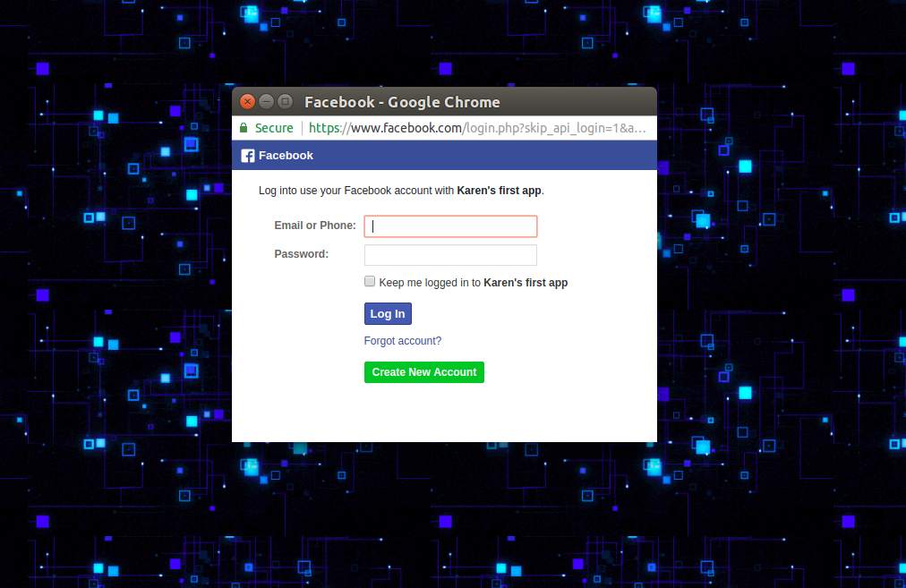
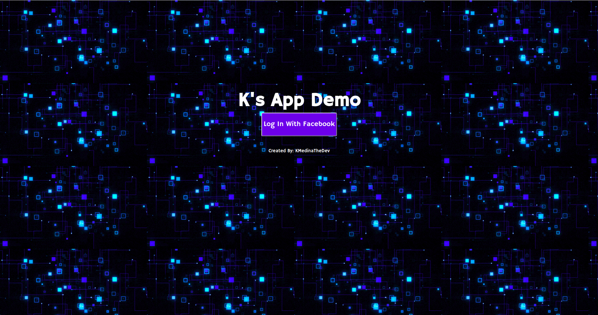

# Interacting With Facebook's API
*work in Progress*

In this demo, My App requires a user to log in with their FB account in order to access information from their public profile.
If the user logs in they are giving permission, so my app may access specific information, such as their name or email. With more permissions you could gain access to much more information such as relationship status, likes films, books, and more. Facebook requires reviewing your app in order to prevent misuse of this information, so for the sake of this demo I kept it simple and only used the basic permissions for the user's first and last name, email, and profile picture.  

## How It's Made:

**Tech used:** HTML, CSS, JavaScript, nodeJS, Facebook sdk

I used HTML, CSS, JavaScript, along with nodeJS to develop a full stack application.

In order to interact with Facebook's API I had to run Facebook's SDK asynchronously. The Facebook SDK consists of five component SDKS:
The Facebook Core SDK (includes Analytics)
The Facebook Login SDK
The Facebook Sharing SDK
The Facebook Places SDK
The Facebook Sharing to Messenger SDK, you can get more information and your own appID *(required)* by visiting: https://developers.facebook.com/docs/apis-and-sdks.

The biggest challenge was sifting through all of FB's documentation.

## Instructions:

This app is in testing mode, only the developer testing it can log in. In order to launch you require a domain for your app, in order to use this demo please create your own appID by visiting Facebook for developers.

## Lessons Learned:
I hadn't used flexbox very often but decided to get some practice with this app's design. I found it incredibly useful.

~ Persistence Trumps Brilliance ~

**Link:** Coming Soon
